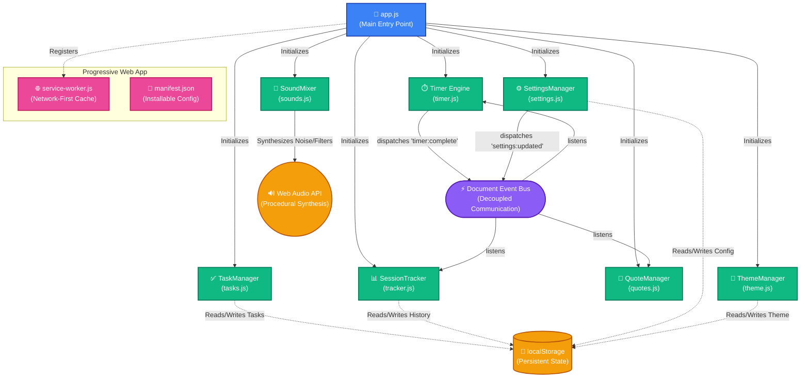

# FocusFlow Core Architecture

This document contains the architecture diagram for the main FocusFlow Progressive Web App (PWA).

```mermaid
flowchart TD
    %% Styling
    classDef main fill:#3b82f6,stroke:#1e40af,stroke-width:2px,color:white;
    classDef module fill:#10b981,stroke:#047857,stroke-width:2px,color:white;
    classDef storage fill:#f59e0b,stroke:#b45309,stroke-width:2px,color:white;
    classDef eventbus fill:#8b5cf6,stroke:#5b21b6,stroke-width:2px,color:white;
    classDef pwa fill:#ec4899,stroke:#be185d,stroke-width:2px,color:white;
    
    %% App Initialization
    APP["🚀 app.js<br/>(Main Entry Point)"]:::main
    
    %% Event Bus
    BUS(["⚡ Document Event Bus<br/>(Decoupled Communication)"]):::eventbus
    
    %% Core Modules
    TIMER["⏱️ Timer Engine<br/>(timer.js)"]:::module
    SOUNDS["🎵 SoundMixer<br/>(sounds.js)"]:::module
    TASKS["✅ TaskManager<br/>(tasks.js)"]:::module
    TRACKER["📊 SessionTracker<br/>(tracker.js)"]:::module
    QUOTES["💬 QuoteManager<br/>(quotes.js)"]:::module
    SETTINGS["⚙️ SettingsManager<br/>(settings.js)"]:::module
    THEME["🎨 ThemeManager<br/>(theme.js)"]:::module
    
    %% Storage & System
    STORAGE[("💾 localStorage<br/>(Persistent State)")]:::storage
    AUDIO(("🔊 Web Audio API<br/>(Procedural Synthesis)")):::storage
    
    %% Initialization Flows
    APP -->|Initializes| TIMER
    APP -->|Initializes| SOUNDS
    APP -->|Initializes| TASKS
    APP -->|Initializes| TRACKER
    APP -->|Initializes| QUOTES
    APP -->|Initializes| SETTINGS
    APP -->|Initializes| THEME
    
    %% Event Flows
    TIMER -- "dispatches 'timer:complete'" --> BUS
    BUS -- "listens" --> TRACKER
    BUS -- "listens" --> QUOTES
    
    SETTINGS -- "dispatches 'settings:updated'" --> BUS
    BUS -- "listens" --> TIMER
    
    %% Storage Flows
    TASKS -.->|Reads/Writes Tasks| STORAGE
    TRACKER -.->|Reads/Writes History| STORAGE
    SETTINGS -.->|Reads/Writes Config| STORAGE
    THEME -.->|Reads/Writes Theme| STORAGE
    
    %% Audio Node
    SOUNDS -->|Synthesizes Noise/Filters| AUDIO
    
    %% PWA Subgraph
    subgraph PWA ["Progressive Web App"]
        SW["🌐 service-worker.js<br/>(Network-First Cache)"]:::pwa
        MANIFEST["📄 manifest.json<br/>(Installable Config)"]:::pwa
    end
    APP -.->|Registers| SW
```
