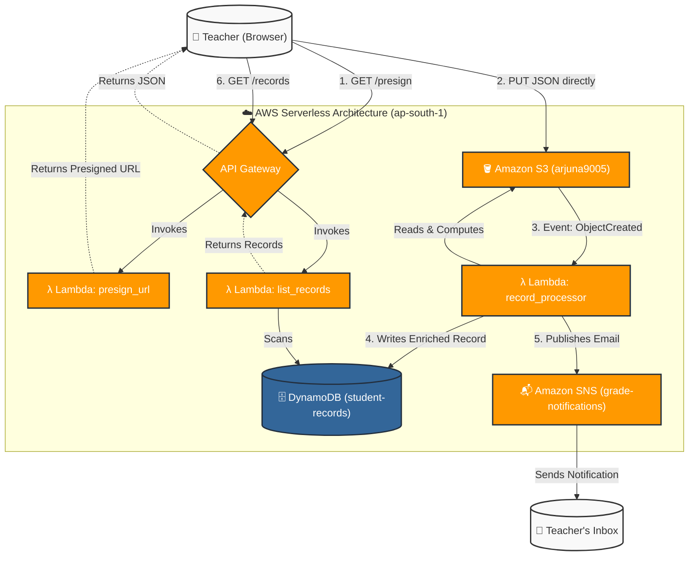

# GradeSync Architecture Diagram

This document contains the AWS serverless architecture diagram for the GradeSync project.

```mermaid
flowchart TD
    %% Styling
    classDef actor fill:#f9f9f9,stroke:#333,stroke-width:2px;
    classDef aws fill:#FF9900,stroke:#232F3E,stroke-width:2px,color:white;
    classDef db fill:#336699,stroke:#232F3E,stroke-width:2px,color:white;
    
    Teacher[("👤 Teacher (Browser)")]:::actor
    Inbox[("📧 Teacher's Inbox")]:::actor

    subgraph AWS["☁️ AWS Serverless Architecture (ap-south-1)"]
        direction TB
        API{"API Gateway"}:::aws
        L1["λ Lambda: presign_url"]:::aws
        S3["🪣 Amazon S3 (arjuna9005)"]:::aws
        L2["λ Lambda: record_processor"]:::aws
        L3["λ Lambda: list_records"]:::aws
        DDB[("🗄️ DynamoDB (student-records)")]:::db
        SNS["📬 Amazon SNS (grade-notifications)"]:::aws
    end

    %% Submission Flow
    Teacher -- "1. GET /presign" --> API
    API -- "Invokes" --> L1
    L1 -. "Returns Presigned URL" .-> Teacher
    
    Teacher -- "2. PUT JSON directly" --> S3
    
    %% Processing Flow
    S3 -- "3. Event: ObjectCreated" --> L2
    L2 -- "Reads & Computes" --> S3
    L2 -- "4. Writes Enriched Record" --> DDB
    L2 -- "5. Publishes Email" --> SNS
    
    SNS -- "Sends Notification" --> Inbox
    
    %% Retrieval Flow
    Teacher -- "6. GET /records" --> API
    API -- "Invokes" --> L3
    L3 -- "Scans" --> DDB
    L3 -. "Returns Records" .-> API
    API -. "Returns JSON" .-> Teacher
```
