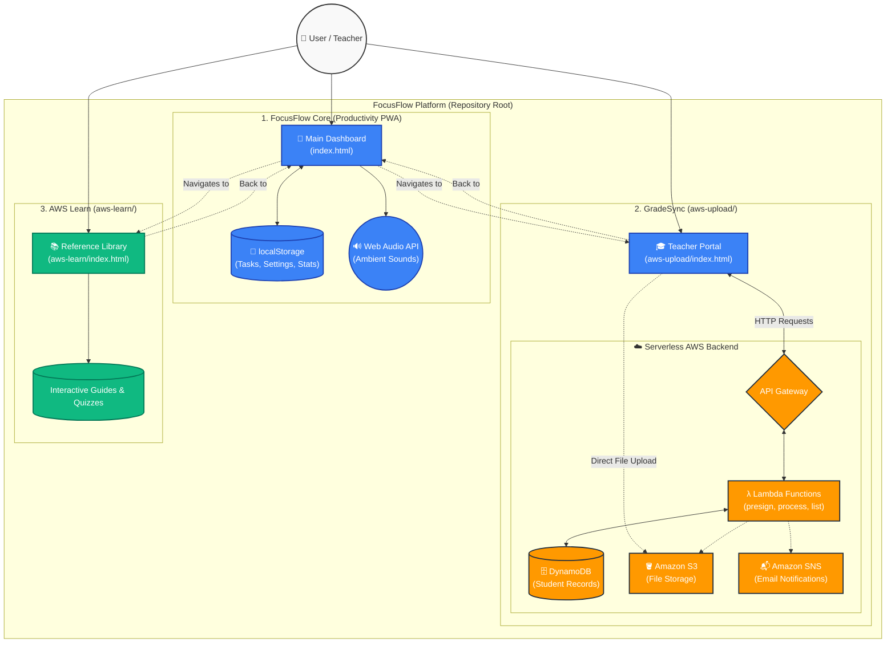

# FocusFlow Platform — Entire Project Architecture

This diagram illustrates the macro-architecture of the entire **FocusFlow repository**, showing how the main application and its sub-projects (GradeSync and AWS Learn) fit together into a unified platform.

### Sub-Project Breakdown:

1. **FocusFlow Core (`/`)**: The main Progressive Web App (PWA) handling Pomodoro timers, task tracking, and ambient sounds. It runs entirely on the client-side without a traditional backend, relying on `localStorage` and Service Workers for offline capabilities.
2. **GradeSync (`/aws-upload/`)**: A teacher-facing grading application demonstrating a fully serverless AWS architecture. The client directly uploads JSON records to S3, triggering Lambda functions to process data, store it in DynamoDB, and dispatch SNS emails.
3. **AWS Learn (`/aws-learn/`)**: An educational module containing interactive reference guides and quizzes to help users understand the AWS services powering GradeSync.
